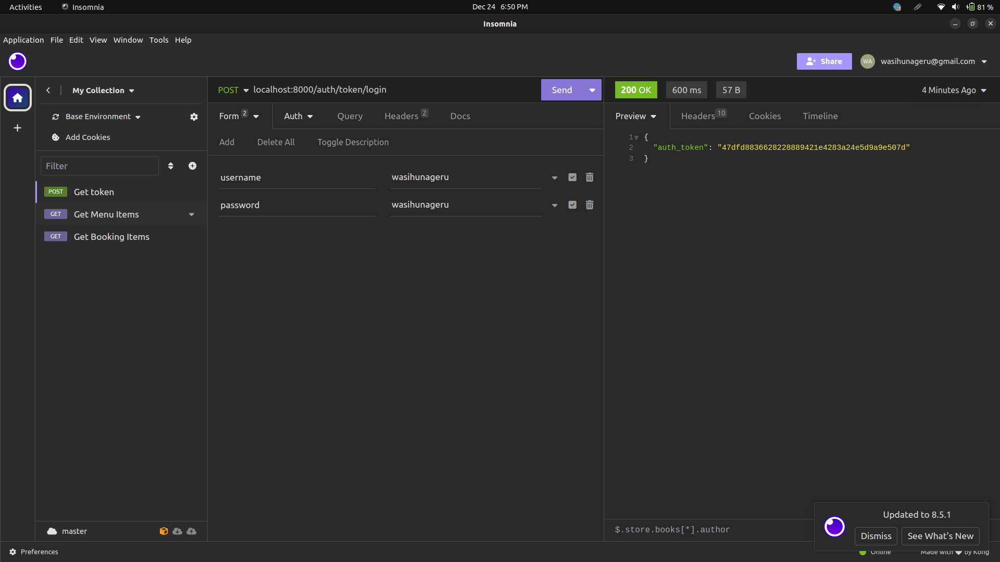
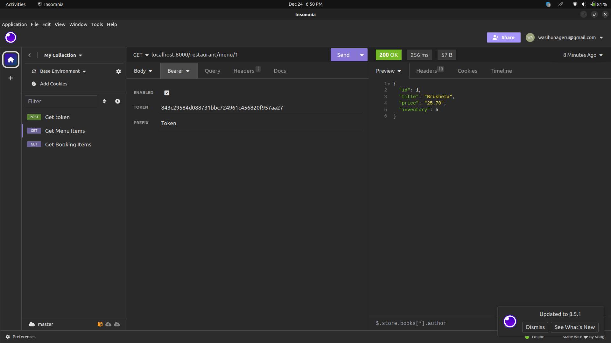

## You can test these routes

    - restaurant/menu/
    - restaurant/menu/<id>
    - restaurant/booking/
    - restaurant/booking/<id>

But before you test you need to `authenticate` yourself with `djoser`.

For this purpose you need to create a user or use an already created user to get a token

You can use `wasihunageru` as both username and password for test purposes

### Get token demo

### Testing` restaurant/menu/<id>` demo

### Testing` restaurant/booking/<id>` demo

