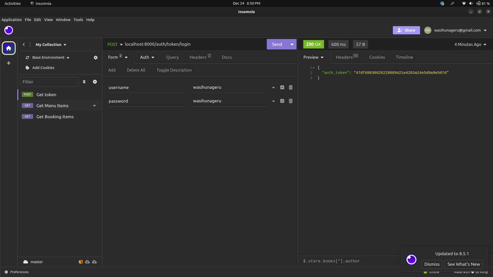
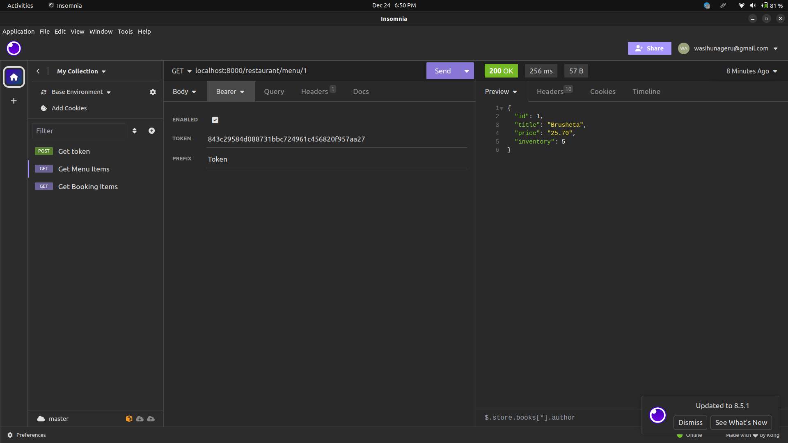

## You can test these routes

    - restaurant/menu/
    - restaurant/menu/<id>
    - restaurant/booking/
    - restaurant/booking/<id>

## Steps for testing

1. `create` a user by making a post request to `auth/users/new/`  with `username` and `password` value provided.
2. You can check if the user is successfully created by visiting `auth/users/me' route
2. Make a get request to `auth/token/login` to get your token. You need to provide username and email
3. Make a get request to 'restaurant/menu' with your token

### Get token demo

### Testing` restaurant/menu/<id>` demo

### Testing` restaurant/booking/<id>` demo

